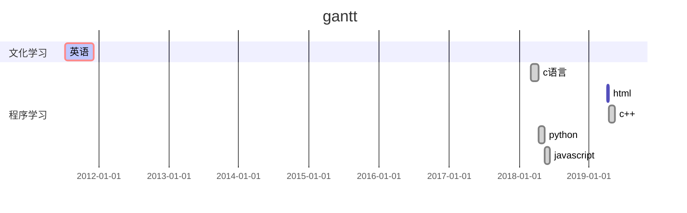
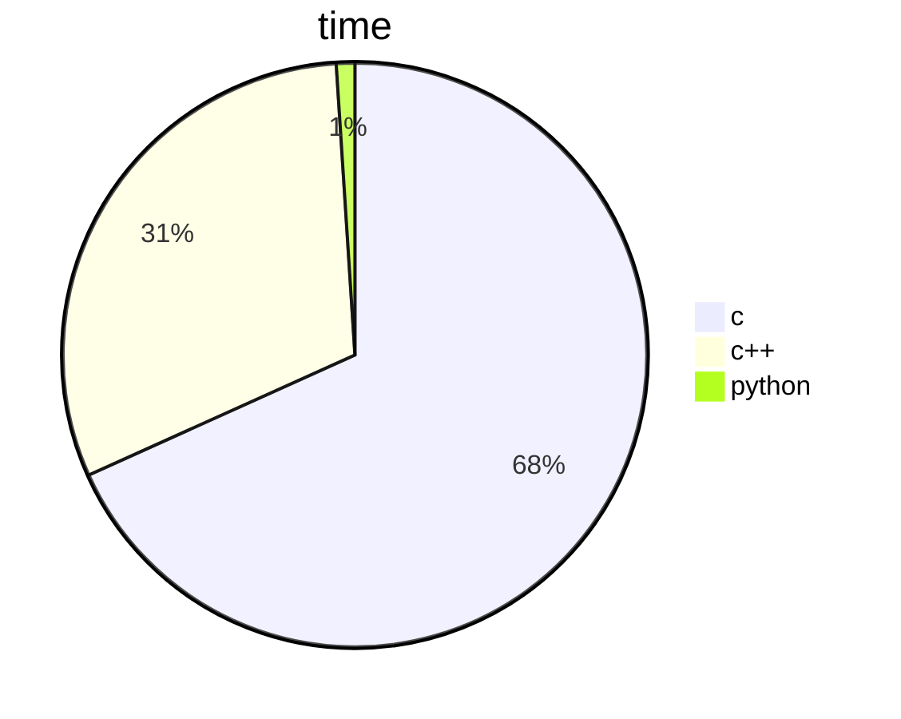

# 心情日记——2020.3.11***MAR***


---


> "He who play a tree ,play a hope"


# ==导航==

* [今日收获](#今日收获)
* [今日反思](#今日反思)
* [规划](#规划)
* [今日感想](#今日感想)
* [脚注解释](#脚注解释)


## 今日收获


1. 英语单词(15+100)个
2. 数学泰勒展开
3. [markdown的语法学习](https://www.bilibili.com/video/av8819726?from=search&seid=12015284832161347700)
4. 洛必达法则在高考[^ex]中的可行

[回到导航](#导航)

---------


# 今日反思


```TEX
	Silent and terrified, the animals crept back into the barn. In a moment the dogs came bounding back. At first no one had been able to imagine where these creatures came from, but the problem was soon solved: they were the puppies whom Napoleon had taken away from their mothers and reared privately. Though not yet full-grown, they were huge dogs, and as fierce-looking as wolves. They kept close to Napoleon. It was noticed that they wagged their tails to him in the same way as the other dogs had been used to do to Mr. Jones. Napoleon, with the dogs following him, now mounted on to the raised portion of the floor where Major had previously stood to deliver his speech. He announced that from now on the Sunday-morning Meetings would come to an end. They were unnecessary, he said, and wasted time. In future all questions relating to the working of the farm would be settled by a special committee
of pigs, presided over by himself. These would meet in private and afterwards communicate their decisions to the others. The animals would still assemble on Sunday mornings to salute the flag, sing Beasts of England, and receive their orders for the week; but there would be no more debates.
```

[回到导航](#导航)

---


# 今日感想


```tex
	我假装我在写感想，就算真的有感想我会这么随便的写出来吗，我就是随便打几个字，练练打字的技巧，毕竟打字这项技能也不是一天两天可以精通的，更何况以后的工作天天用到它\
	
	"Silent and terrified, the animals crept back into the barn. In a moment the dogs came bounding back. At first no one had been able to imagine where these creatures came from, but the problem was soon solved: they were the puppies whom Napoleon had taken away from their mothers and reared privately. Though not yet full-grown, they were huge dogs, and as fierce-looking as wolves. They kept close to Napoleon. It was noticed that they wagged their tails to him in the same way as the other dogs had been used to do to Mr. Jones. Napoleon, with the dogs following him, now mounted on to the raised portion of the floor where Major had previously stood to deliver his speech. He announced that from now on the Sunday-morning Meetings would come to an end. They were unnecessary, he said, and wasted time. In future all questions relating to the working of the farm would be settled by a special committee
of pigs, presided over by himself. These would meet in private and afterwards communicate their decisions to the others. The animals would still assemble on Sunday mornings to salute the flag, sing Beasts of England, and receive their orders for the week; but there would be no more debates.""

	没错，上面的文本就是我从网上找来凑字数的
```

[回到导航](#导航)

---


# 规划






[回到导航](#导航)

-----


# 脚注解释

[^ex]:全国高等学院统一招生考试

[回到导航](#导航)


---


<div style="position:absolute;right:0px;bottom:0px;color:blue;">
    2020-3-14<br>
		----wirte_by晓墨
</div>

---

